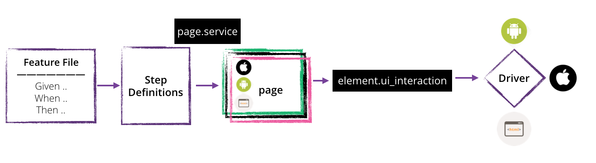

# Cross Platform mobile automation framework 

An automation, rather a test code, which does not go to a production but it is a health matrics of out production code. And when code, you need to follow good practices. (eg. Proper abstraction in place, Reusing code, seperation of concerns etc).

We faced problem in automating flows on multiple platforms. We tried to solve one problem at a time and came up with this solution.


### Page Object pattern 
Cucumber has a concept of global state which is typically accessed by all tests. This is significantly detrimental to the overall health of the behavior tests and results in a code mess up. We use the Page Object pattern to bring structure and predictability in our tests. This helps us define a few conventions and curate them better over a period of time. It also helps in reusability of steps and flows across tests. [Here’s](http://martinfowler.com/bliki/PageObject.html) a simplified explanation of page object in terms of web apps by Martin Fowler. 

### Automation expectations

Given cross platform apps and in rapid development cycle, we expect our automation cycle to work fast. That means: 

1. It should be easier to add automation across platforms. 
2. Modification should be simpler. Being different platform, the functionality remains similar across platforms. If this is the case, we should not end up modifying same code across the different platforms.
3. Should reuse the code as much as possible.


### Well, we are not the first one to face this problem ..

1. [Calabash-X Plaform](https://github.com/calabash/x-platform-example)

    This sample project by calabash solved a problem of cross platform using different pages for different platforms. Which Platform page to invoke, is decided by the current platform for which test execution is being done.
2.  [Strategy pattern for different platforms](http://www.3pillarglobal.com/insights/design-patterns-in-automation-testing)

    In this case, strategy pattern is used, a slight variation of above example. Still a very similar appraoch, different pages indicate different platforms.
    
3. [Screen Object pattern](https://rubygemtsl.com/2014/01/06/designing-maintainable-calabash-tests-using-screen-objects-2/)


### Solution analysis of above solutions:

If we look at above examples, they have used Page Object pattern and tried to bring the discipline. 

1. Too many pages

    In our case, we have approx 60 screens for ios and android and 30 screens for web. If we try to implement different pages for different platforms, we will end up having 150 classes, a classic class explosion problem! Maintainence and modification will become a nightmare! 
2. Reusing the code

    As there will be different pages, we will end up having similar services for each of the page. 
3. Making change at one place!

    It's not at all possible to change at one and it will work for other platforms. We will have to update all platform specific pages to make this work.
4. Adding new automation/modification

    If similar functionality will be developed for all platforms, then we will end up writing 'n' number of pages for 'n' platforms and at the end, repeating ourself!
 
So clearly, having seperate pages for different platforms, doesn't seem to go well with out need. To avoid all above mentioned problems, we came up with a problem statement:
> Create a cross platform mobile UI automation framework which will work seemlessly across different platforms.

### Challenges in implementating Single page for different platforms: 

1. Different automation tool

    Consider platforms, iOS, android, mobile web. Each API will expose different services for same action. 
2. Different UI actions

    `click` is for web whereas similar action for other platform is, `touch`
3. Locator

    As the ecosystem is different for platforms, they way we identify locator will be different. Also, despite being same screen, locator can be different.
4. Different UI navigation pattern

    Each platform gives different UI component. We have Tab bar in iOS, navigation drawer in Android and Nav bar serves similar purpose for web. 

We gave it a try and solved above problems one by one. 

1. Different locator
     ```ruby 
     {
        web: "#Food Items:"
        droid: "* id:'FoodItems'"
        ios: "* title:'Food Items'"
     }
   
     ```

2. Element Abstraction

   As page should be platform agnostic 


3.Different UI actions and different automation tool 

  Both calabash-android and calabash-ios have similar programmatic apis to tap, touch, scroll and pinch/zoom. However, they are not uniform in naming and implementation underneath.Whereas, watir webdriver is completely different than these two. 
  So we needed some abstraction layer, which will expose the same API and on the other side, invoke respective tool's action. 
  
 Here the goal is to create a consistent API for all platforms and page will call those API. With this design our code becomes agnostic of the framework used underneath.

This implementation is done by conditionally invoking different `driver` for different platforms. 
If you look out in the project, you will find 3 driver files, which represent 3 different platforms. 



The biggest advantage of this approach is that we write our tests only once for either of the frameworks. 


### Folder structure 

```
├── app/
│   ├── models
│   ├── page
│   ├── |──page_registry                            # Page residtry which will hold reference to all pages
│   ├── |──page                                     # Base page for all the pages        
│   ├── pages                                       # All the pages in the app will be created here        
│  
│── framwework/                                     # Have all elements (element, radio_button, textbox etc)
│   │   ├── elements                                # These elements will delegate any action to driver
│   │   ├── ├── textbox
│   │   ├── ├── radio_button
│   │   ├── ├── ....
|
│   ios                                             # This folder will be included only when ios specific tests are invoked
│   │   ├── driver.rb                               # ios Specific driver, which will interact with UI elemenets
│   │   ├── env.rb                                  # env.rb, This load require files needed to execute ios tests
│   │   ├── app_life_cycle_hooks                    # Handles before and after hooks for scenarios.
│   
│   droid                                           # This folder will be included only when droid specific tests are invoked
│   │   ├── driver.rb                               # droid Specific driver, which will interact with UI elemenets
│   │   ├── env.rb                                  # env.rb, This load require files needed to execute droid tests
│   │   ├── app_life_cycle_hooks                    # Handles before and after hooks for scenarios.
|
│   web                                             # This folder will be included only when web specific tests are invoked
│   │   ├── driver.rb                               # web Specific driver, which will interact with UI elemenets
│   │   ├── env.rb                                  # env.rb, This load require files needed to execute droid tests
│   │   ├── life_cycle_hooks                        # Handles before and after hooks for scenarios.
|
│   rake_tasks
│   │   ├── page_template                           # Page template to create page 
│   │   ├── run_test  
```
 
### Navigation Pattern solved. 


### Page Template 


## Commands to run:

1. For web:

`bundle exec cucumber -r web`

2. For iOS:

`bundle exec cucumber -p ios`

3. For android:

`calabash-android run prebuilt/FoodX-droid.apk -p android`

For more information check out [blog](https://pritibiyani.github.io/blog/speaking-at-vodqa-banglore)
